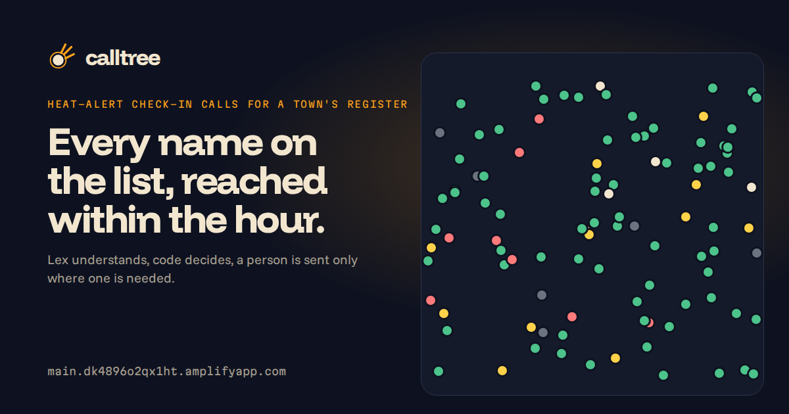
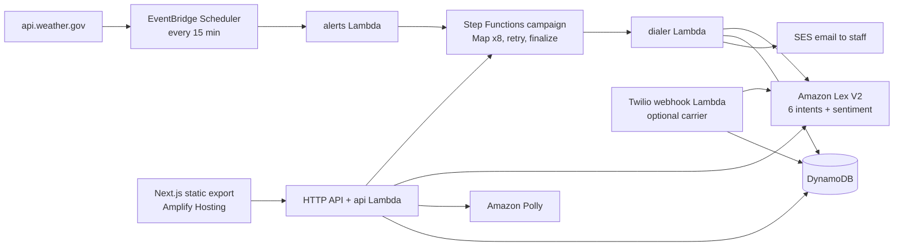

# Calltree

**When a heat warning hits, Calltree phones every isolated elderly person on a town's register, asks three questions, and sends a human only to the ones who did not pick up or said something worrying.**

AWS Builder Center · Zero to Shipped 2026 · `#social-good` (climate resilience, health) · `#startup`

| | |
|---|---|
| Live app | https://main.dk4896o2qx1ht.amplifyapp.com |
| API | https://tdj1t6l3hj.execute-api.us-east-1.amazonaws.com (`/health`, `/state`, `/report/{drill}`) |
| Demo without the API | https://main.dk4896o2qx1ht.amplifyapp.com/ops/?demo=1 |
| Video | VIDEO_URL |
| Region | us-east-1 |

## The problem

Europe's summer of 2022 killed 61,672 people by heat ([Nature Medicine](https://www.nature.com/articles/s41591-023-02419-z)). Most were old, most died alone at home. France has required every mayor to keep a register of vulnerable people and contact them during heat waves since 2004 (art. L121-6-1 CASF). In the 2025 heat wave, 96% of French municipal social centres ran phone chains, half of the people on the registers were hard to reach, and only a third of centres had enough staff ([UNCCAS survey](https://www.banquedesterritoires.fr/les-ccas-pendant-la-canicule-une-mobilisation-massive-mais-sous-tension)). New York put 600 outreach workers on the street for wellness checks in July 2026. 16.2 million Americans over 65 live alone.

The city's tool today is a spreadsheet and a volunteer phone tree. It takes two days. The people nobody reached are the ones who die.

## What Calltree does

1. **A heat warning.** EventBridge Scheduler polls the National Weather Service zone (AZZ544, Maryvale in Phoenix) every 15 minutes. A new warning starts the campaign on its own. A coordinator can also declare a drill.
2. **Every line rings.** Step Functions fans out eight calls at a time, waits, retries anyone who did not pick up, and never skips a name.
3. **Three questions.** How are you feeling? Is your cooling working and do you have water? Do you need anything? Amazon Polly asks; Amazon Lex V2 understands each answer with a confidence and a sentiment.
4. **Code decides, not a prompt.** OK requires three clear affirmatives. Anything on the never-OK list ("light-headed", "fell", "chest") is urgent. Anything unclear goes to a person. [`decide.mjs`](backend/src/lib/decide.mjs) is 120 lines, unit tested, and scored on 60 labelled calls with a hard gate: zero URGENT or UNSURE calls may come out OK.
5. **A person acts.** A neighbour is called for urgent cases, staff call back the unclear ones, a delivery goes to anyone without cooling, a visit is queued after two no-answers. Every escalation stays in the queue until someone marks it resolved.



| A heat drill on the 3D map | Answering the call yourself |
|---|---|
|  |  |

## Try it in two minutes

- Open **https://main.dk4896o2qx1ht.amplifyapp.com/ops/**. The town is a 3D map with one column per resident; the last drill is already standing. Click **Declare heat drill**: the status surface flips to cobalt, eight lines start dialing, and columns rise green, amber and red in call order while the dispatch log prints the deciding quote for each call.
- Click a red column, or its row in the log: "I'm fine, just a bit light-headed." Marked URGENT because "light-headed" is on the never-OK list and underlined in the transcript; the neighbour alert is recorded.
- Open **Get called yourself**, type a first name, answer the call in your own voice (Chrome or Edge with a microphone, or type). Say "I feel dizzy" on purpose. Your pin appears on the map, red, with your quote.
- Open **View report** for the numbers: time to reach everyone, reach rate, escalations, cost per resident, and the classifier evaluation table.

## The proof numbers

| Number | Where it comes from |
|---|---|
| Minutes from alert to every first attempt | Timestamps of the campaign, shown on `/report` |
| Zero URGENT or UNSURE calls classified OK | `scripts/eval.mjs` over `seed/eval.json` against the live Lex bot; result stored and shown on `/report` |
| Cost per resident per drill | Lex, Polly, Lambda and Step Functions list prices summed per call |
| Projected time with real phone lines | 45 s per call, 8 lines, one retry |

## Architecture



## What is real, what is simulated

- **Real:** Lex understanding, decision rules, retries, escalations, the report, the NWS watch, the browser call in your own voice, SES notifications to staff.
- **Synthetic:** the 100 residents. Every name and number is generated. No real person's data is on this register.
- **Not on this account:** the phone line. This AWS account is billed through AISPL, which cannot create Amazon Connect instances or Chime SDK phone numbers (both were attempted; see `DEVLOG.md`). The carrier is pluggable: a Twilio number attaches with three environment variables and runs the same pipeline. Ring time in the simulated carrier is compressed to seconds.

## Run it

```bash
npm ci --prefix backend && npm test --prefix backend
MOCK_MODE=1 SIM_PACE=0 node scripts/verify.mjs      # whole pipeline offline, prints PASS/FAIL
scripts/deploy.sh                                   # SAM -> seed -> eval publish -> Amplify
```

## How the coding agent built it

Claude Code, connected to this AWS account through the AWS MCP server (Agent Toolkit for AWS) with the same credentials as the console. The agent ran the account checks, discovered that Bedrock, Amazon Connect, Chime SDK PSTN and Amazon Location keys are all unavailable on this AISPL account, and changed the design each time: Lex instead of an LLM, a pluggable carrier instead of Connect, keyless tiles instead of a Location key. The full timeline with what it got wrong is in [`DEVLOG.md`](DEVLOG.md); the decisions are in [`docs/adr/`](docs/adr/).

## Limitations

- No real PSTN calls on this deployment. The browser call is the same conversation; a phone number needs a carrier credential.
- English only. Thirty-five percent of the seeded register is marked Spanish-speaking; the prompts are English for this demo.
- The never-OK list is a starting point written for the demo, not a clinical instrument. Everything it misses lands in UNSURE and goes to a person, which is the point.
- Bedrock is not used because model invocation is blocked on this account. An LLM adjudicator for UNSURE cases is a flag away and does not change the guarantee.

## Tags

`#social-good` `#startup`
